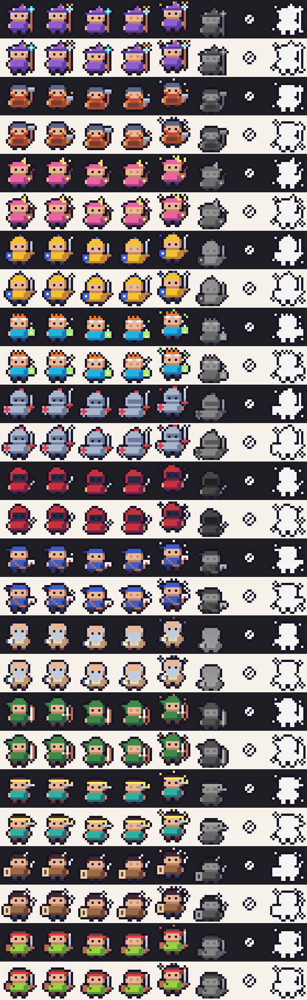

# claude-code-mods

[Mods](https://code.claude.com/docs/en/plugins/mods/overview) for Claude Code: plugins whose code runs inside Claude Code and can draw in its interface. This repository is a plugin marketplace, so you can install each mod by name.

| Mod | What it does |
|---|---|
| [agent-party](plugins/agent-party) | Shows your running subagents as 16×16 pixel heroes above the prompt. Each hero shows its task, what it is doing right now, how long it has worked and how many tokens it has used. A voice tells you when agents start and finish. Comes with a fantasy-party cast and a wizarding-school cast. |



## Install

Mods need Claude Code v2.1.287 or later (`claude --version`).

From a Claude Code session:

```text
/plugin install agent-party --marketplace ytruong11201/claude-code-mods
```

Or from your shell:

```bash
claude plugin marketplace add ytruong11201/claude-code-mods
claude plugin install agent-party@ytruong11201-mods
```

Run `/reload-plugins` in an open session, or start a new one. `/plugin` then lists `1 mod active · agent-party`.

## Update

```bash
claude plugin update agent-party@ytruong11201-mods
```

## Trust

A mod is code that runs with your permissions. Read it before you install it. To see the events a mod hooks and every Claude Code API it calls, without running it:

```bash
claude plugin validate ./plugins/agent-party
```

## License

[MIT](LICENSE)
