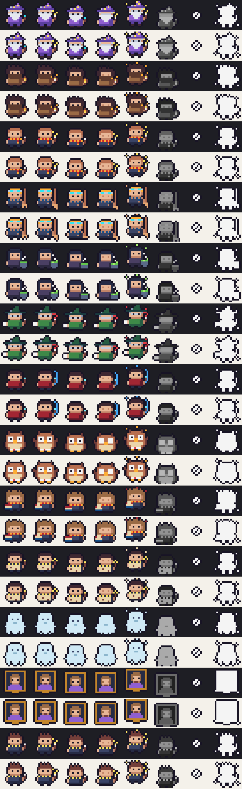

# Agent Party

A Claude Code mod that turns every subagent you spawn into a 16×16 pixel hero in a band above the prompt.

**[▶ Try the live demo](https://ytruong11201.github.io/claude-code-mods/agent-party/)**. It draws the same sprites and speech bubbles the mod draws in your terminal. The browser copy lives in [`docs/agent-party/`](../../docs/agent-party/index.html); rebuild it with `demo/build.sh ../../docs/agent-party/index.html`.

```
 ▄██▄        ╭────────────────────────────────╮
 █▀▀█        │ Plan the product search page   │
 ▀██▀        │ Reading product.service.ts     │
 ▀  ▀        ╰────────────────────────────────╯
              planner the Wizard · Lv 12
              ⏱ 10m 7s · ↓ 231.3k tokens
```

- A hero appears with a poof when its agent is spawned, bobs while it works, and hops with sparkles when it finishes. If the agent is stopped, the hero is knocked out (grey). It leaves the stage 20 seconds after it finishes.
- The speech bubble shows the agent's task, and below it what the agent is doing right now, from its latest tool call.
- The level goes up by one with each tool call. The timer and token count update as the agent works.
- A voice tells you who started and who finished. While an agent works, it gives at most one status line per agent every 45 seconds.

Tested with Claude Code v2.1.289. The mods API can change between releases.

## Commands

| Command | What it does |
|---|---|
| `/agent-theme` | Switches between the two casts. `/agent-theme party` or `/agent-theme wizarding` picks one. Your choice is saved across sessions. |
| `/agent-voice` | Turns the voice on or off |

## Casts

| Agent type | `party` (default) | `wizarding` |
|---|---|---|
| planner | Wizard | Headmaster |
| backend-developer | Dwarf Smith | Groundskeeper |
| frontend-developer | Bard | Charms Student |
| fullstack-developer | Paladin | Broom Rider |
| tester | Alchemist | Potions Master |
| code-reviewer | Knight | Professor |
| security-auditor | Rogue | Dark Arts Defender |
| git-manager | Courier | Post Owl |
| researcher | Sage | Library Prefect |
| Explore | Ranger | Night Explorer |
| scout | Scout | Castle Ghost |
| docs-manager | Scribe | Talking Portrait |
| any other type | Adventurer | First-Year |

The wizarding cast is made of original archetypes, not characters from any book or film.



Each row in the image shows one hero, with these frames from left to right:
- working, with its idle bob and blink
- victory hop
- knocked out
- the two spawn frames

## How it works

| | |
|---|---|
| Pixels | One terminal cell holds two pixels: an upper half block `▀` coloured with the top pixel and backed by the bottom one. A hero is 16 columns × 8 rows. The desktop app can't draw these sprites, so it shows an emoji instead. |
| Animation | 4 fps. The work loop steps every 250 ms and the idle bob every 500 ms. A blink comes every 4 s. |
| Hooks | `agent.spawn` puts a hero on stage. `tool.call` fills the speech bubble. `turn.step` counts tokens, and `turn.complete` ends the quest. |
| Voice | Uses Claude Code's system speech (`say` on macOS). If that fails, it falls back to `spd-say` on Linux. If neither works, it turns the voice off and shows a notice. |
| Art | Sprites are data in `hooks/heroes.ts` and `hooks/heroes-wizarding.ts`. `hooks/art.ts` combines a shared body with each class's hat, outfit and prop, then adds the animation and a 1px outline. |

The design follows common pixel-art practice for 16×16 characters:
- chibi proportions, with a big head on a short body
- a full dark outline, so heroes read on dark and light terminals
- 5–7 colours per sprite, lit from the top left
- class colours from the [Endesga 32](https://lospec.com/palette-list/endesga-32) and [Sweetie 16](https://lospec.com/palette-list/sweetie-16) palettes

## Develop

```bash
claude --plugin-dir ./plugins/agent-party   # edits reload as you save
claude plugin validate ./plugins/agent-party
claude plugin test ./plugins/agent-party
```

The browser demo is built from the same art files. Running `demo/build.sh <out.html>` writes a single-file HTML page with a scripted quest and the full roster. It needs Node.js, and it fetches esbuild through `npx`.
